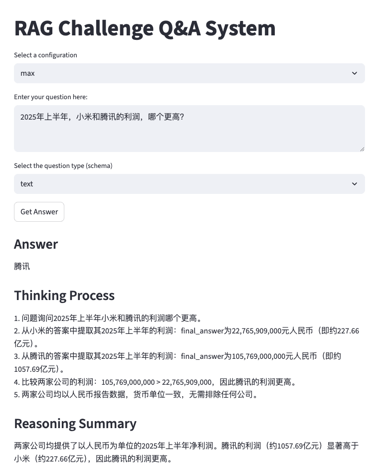
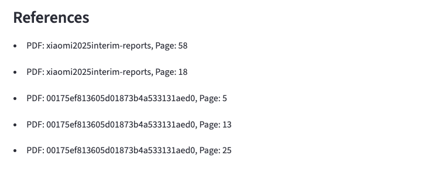

[English](README.md) | [简体中文](README.zh-CN.md)

# RAG Challenge 获奖解决方案 - 无 GPU 改造版

## 致谢与项目说明

### 项目背景

本项目源于对 RAG（检索增强生成）技术的研究需求。当我发现 [Ilya Rice (Ilya Ryabov)](https://github.com/IlyaRice) 创建的这个优秀的 RAG Challenge 获奖解决方案后，意识到原版项目对本地机器的性能要求较高，特别是需要 GPU 来进行 PDF 解析（原作者使用的是 RTX 4090）。

**为了让更多没有高性能 GPU 的小伙伴也能运行和研究这个优秀的 RAG 项目，我进行了必要的修改：**

- **替换了 PDF 解析方案**：将原版的 Mockling 本地解析（需要 GPU）改为使用 [Mineru API](https://www.mineru.com/)，使得 PDF 解析过程可以通过 API 完成，无需本地 GPU。
- **适配了向量化模型**：使用千问的 text-embedding-v3 模型进行向量化，无需本地部署模型。
- **集成千问 API**：使用千问 API 进行问答和重排序，进一步降低了本地硬件要求。

感谢 [Ilya Rice (Ilya Ryabov)](https://github.com/IlyaRice) 为本项目提供了坚实的基础，也感谢 [Mineru](https://www.mineru.com/) 提供的强大 API 服务。

**原项目资源：**
- Russian: https://habr.com/ru/articles/893356/
- English: https://abdullin.com/ilya/how-to-build-best-rag/

---

## 项目简介

这个存储库包含 RAG 挑战赛中两个奖项提名的获胜解决方案，并在此基础上进行了修改，使其能在无 GPU 的环境下运行。该系统在回答公司年度报告问题方面取得了最先进的结果，结合了以下技术：

- 使用 Mineru API 进行自定义 PDF 解析，并对结果进行格式适配。
- 带有父文档检索的向量搜索。
- 用于改进上下文相关性的 LLM 重排序。
- 带有思维链推理的结构化输出提示。
- 用于多公司比较的查询路由。
- 集成了千问 API 进行问答。
- 提供了一个基于 Streamlit 的图形用户界面。

## 效果展示



### 免责声明

这是竞赛代码，它可能比较粗糙但能正常工作。在您深入了解之前，请注意以下几点：

- 代码可能存在一些粗糙的边缘和奇怪的变通方法。
- 我们的测试并不严谨。
- 您需要自己的 Mineru 和 Qwen 甚至OpenAI/Gemini的 API 密钥。
- ✨ **无需 GPU**：本修改版通过使用 API 服务替代了本地 GPU 密集型处理。

如果您正在寻找生产就绪的代码，这不是。但如果您想探索不同的 RAG 技术及其实现，并且在没有 GPU 的情况下使用——请查看！

## 主要修改

### PDF 解析
- 原版使用 Mockling 进行本地 PDF 解析，对机器性能要求较高（需要 GPU）
- **改进**：改为使用 Mineru API，对返回的格式进行适配以符合后续流程

### 向量化模型
- **改进**：使用千问的 text-embedding-v3 模型，通过 API 调用，无需本地部署

### LLM 重排序
- **改进**：集成千问模型进行 ranking
- **注意**：使用千问模型时，必须在提示词中明确提及 "JSON" 以及期望的 JSON 格式


### 快速开始

克隆并设置：

```bash
git clone https://github.com/IlyaRice/RAG-Challenge-2.git
cd RAG-Challenge-2
python -m venv venv
vvenv\Scripts\Activate.ps1  # Windows (PowerShell)
pip install -e . -r requirements.txt
pip install streamlit # 为 Streamlit UI 添加依赖
```

将 `env` 文件重命名为 `.env` 并添加您的 API 密钥，包括 `OPENAI_API_KEY` / `GEMINI_API_KEY`, `MINERU_API_KEY` 和 `QWEN_API_KEY`。

### 测试数据集

该存储库包含两个数据集：

1.  一个小型测试集（在 `data/test_set/` 中），包含 5 份年度报告和问题。
2.  完整的 ERC2 竞赛数据集（在 `data/erc2_set/` 中），包含所有竞赛问题和报告。

每个数据集目录都包含自己的 `README`，其中包含特定的设置说明和可用文件。您可以使用任一数据集来：

-   研究示例问题、报告和系统输出。
-   使用提供的 PDF 从头开始运行管道。
-   使用预处理数据直接跳到特定的管道阶段。

请参阅相应的 `README` 文件以获取详细的数据集内容和设置说明：

-   `data/test_set/README.md` - 适用于小型测试数据集。
-   `data/erc2_set/README.md` - 适用于完整竞赛数据集。

### 用法

您可以通过取消注释 `src/pipeline.py` 中要运行的方法并执行以下命令来运行管道的任何部分：

```bash
python .\src\pipeline.py
```

您还可以使用 `main.py` 运行任何管道阶段，但您需要从包含数据的目录中运行它：

```bash
cd .\data\test_set\
python ..\..\main.py process-questions --config max_nst_o3m
```

### CLI 命令

获取可用命令的帮助：

```bash
python main.py --help
```

可用命令：

-   `parse-pdfs` - 使用 Mineru API 解析 PDF 报告，并进行并行处理（如果您仍需本地 Docling 解析，请注意此命令已修改）。
-   `serialize-tables` - 处理已解析报告中的表格。
-   `process-reports` - 在已解析报告上运行完整的管道。
-   `process-questions` - 使用指定配置处理问题。

每个命令都有自己的选项。例如：

```bash
python main.py parse-pdfs --help
# 请注意，PDF 解析将通过 Mineru API 进行, 处理时间视乎 Mineru 的速度，我这边测试解析3份年报用时140秒

python main.py process-reports --config ser_tab
# 使用序列化表格配置处理报告
```

### 一些配置

-   `max_nst_o3m` - 使用 OpenAI 的 o3-mini 模型的最佳性能配置。
-   `ibm_llama70b` - 使用 IBM 的 Llama 70B 模型的替代方案。
-   `gemini_thinking` - 使用 Gemini 巨大上下文窗口的完整上下文问答。这实际上不是 RAG。
-   `qwen_config` - 使用千问 API 的配置。

请查看 `pipeline.py` 以获取更多配置和详细信息。

### 图形化界面

```bash
streamlit run streamlit_app.py
```

### 许可证

MIT

